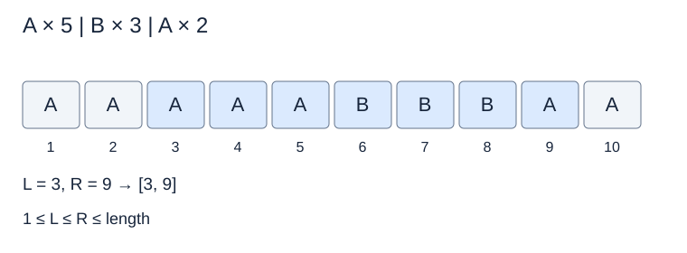

# FB-L2 · 압축 문서의 구간 조회

## 문제 설명

문자와 반복 횟수의 쌍 N개를 이어 붙이면 긴 문서가 됩니다. 문서의 위치는 1부터 시작합니다.  
  
문서를 전부 출력하는 대신, L번부터 R번까지 양 끝을 포함한 구간에서 문자 C가 몇 번 등장하는지 구하세요. 같은 문자가 이웃한 여러 압축 쌍으로 나뉘어 있을 수도 있습니다.  
  
압축을 풀면 문서가 매우 길어질 수 있습니다. 주어진 구간 밖의 문자는 답에 포함하지 않습니다.



A 5, B 3, A 2를 펼친 문자열입니다. 색칠된 부분만 조회 대상으로 삼습니다.

## 입력

전체 입력의 첫 줄에는 테스트케이스 수 T가 주어집니다. (1 ≤ T ≤ 3)  
이후 아래 설명에 따라 테스트케이스가 T개 이어집니다. 테스트케이스 사이에 빈 줄은 없습니다.  
  
첫 줄에 N, L, R, 찾을 문자 C가 주어집니다. 다음 N줄에 압축 쌍이 주어집니다.  
  
한 줄의 여러 값은 공백으로 구분됩니다. 문자열·지도 행의 공백 여부는 위 설명을 따르세요.

## 제약조건

- 1 ≤ N ≤ 100
- 문자는 A~Z입니다.
- 1 ≤ 각 반복 횟수 ≤ 1000000
- 1 ≤ L ≤ R ≤ 전체 문서 길이

## 출력

각 테스트케이스마다 한 줄에 #과 테스트케이스 번호 tc를 붙여 출력하고, 공백 한 칸 뒤에 정답을 출력합니다.  
tc는 1부터 시작합니다. 예: #1 10  
  
구간 안에 있는 C의 개수를 출력합니다.

```text
#tc answer
```

## 예제 입력

```text
2
3 3 9 A
A 5
B 2
A 4
1 1 5 B
A 5
```

## 예제 출력

```text
#1 5
#2 0
```

## 공백과 줄바꿈 안내

코드 블록 안의 띄어쓰기는 실제 공백이며, 각 행은 실제 줄바꿈입니다. 긴 예제는 두 테스트케이스에서 일부 줄만 표시합니다. …는 생략 표시이며 실제 데이터가 아닙니다. 전체 보기 기능은 제공하지 않습니다.
