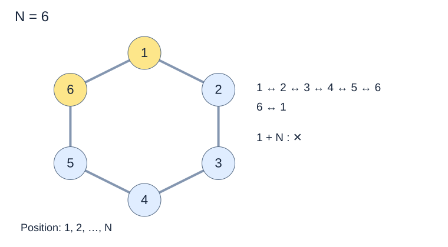

# FB-L5 · 원형 선반의 안전 장치

## 문제 설명

N개의 안전 장치가 원형으로 배치되어 있고, 각 장치를 켰을 때의 출력이 주어집니다. 서로 이웃한 두 장치를 동시에 켤 수 없습니다. 1번과 N번도 이웃입니다.  
  
한 개 이상의 장치를 선택해 출력 합을 B 이상으로 만들려고 합니다. 가능한 합 중 가장 작은 값을 골라 목표 B를 초과하는 양을 구하세요.  
  
출력은 모두 양수이며 장치를 중복으로 선택할 수 없습니다. 조건을 만족하는 선택이 없으면 -1을 출력합니다.



마지막 장치와 첫 장치도 이어져 있습니다. 노란색은 이 경계의 두 장치를 강조한 것이며 선택 결과가 아닙니다.

## 입력

전체 입력의 첫 줄에는 테스트케이스 수 T가 주어집니다. (1 ≤ T ≤ 3)  
이후 아래 설명에 따라 테스트케이스가 T개 이어집니다. 테스트케이스 사이에 빈 줄은 없습니다.  
  
첫 줄에 장치 수 N과 목표 B, 다음 줄에 원을 따라 순서대로 출력 N개가 주어집니다.  
  
한 줄의 여러 값은 공백으로 구분됩니다. 문자열·지도 행의 공백 여부는 위 설명을 따르세요.

## 제약조건

- 3 ≤ N ≤ 36
- 1 ≤ ai ≤ 1000
- 1 ≤ B ≤ 36000

## 출력

각 테스트케이스마다 한 줄에 #과 테스트케이스 번호 tc를 붙여 출력하고, 공백 한 칸 뒤에 정답을 출력합니다.  
tc는 1부터 시작합니다. 예: #1 10  
  
B 이상인 최소 출력 합에서 B를 뺀 값을 출력합니다. 불가능하면 -1입니다.

```text
#tc answer
```

## 예제 입력

```text
2
4 7
4 2 5 3
3 6
5 5 5
```

## 예제 출력

```text
#1 2
#2 -1
```

## 공백과 줄바꿈 안내

코드 블록 안의 띄어쓰기는 실제 공백이며, 각 행은 실제 줄바꿈입니다. 긴 예제는 두 테스트케이스에서 일부 줄만 표시합니다. …는 생략 표시이며 실제 데이터가 아닙니다. 전체 보기 기능은 제공하지 않습니다.
