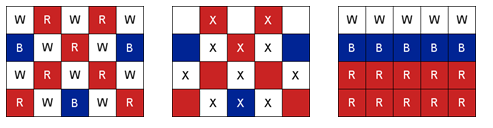

# S1-L5 · 러시아 국기 같은 깃발

## 문제 설명

N행 M열의 깃발을 위에서부터 흰색, 파란색, 빨간색의 세 가로 구역으로 나누려고 합니다.  
  
각 구역에는 적어도 한 행이 있어야 하며, 구역 안의 모든 칸은 해당 색이어야 합니다. 행의 순서를 바꾸거나 빈 구역을 만들 수 없습니다.  
  
현재 색과 다른 색으로 칠하는 칸 하나마다 비용 1이 듭니다. 조건을 만족하도록 바꾸는 최소 칸 수를 구하세요.



현재 색, 변경할 칸(X), 완성된 세 색 구역

## 입력

전체 입력의 첫 줄에는 테스트케이스 수 T가 주어집니다. (1 ≤ T ≤ 3)  
이후 아래 설명에 따라 테스트케이스가 T개 이어집니다. 테스트케이스 사이에 빈 줄은 없습니다.  
  
첫 줄에 N과 M, 다음 N줄에 길이 M인 색 문자열이 주어집니다. 행 안에는 공백이 없습니다.  
  
한 줄의 여러 값은 공백으로 구분됩니다. 문자열·지도 행의 공백 여부는 위 설명을 따르세요.

## 제약조건

- 3 ≤ N, M ≤ 50
- W는 흰색, B는 파란색, R은 빨간색입니다.

## 출력

각 테스트케이스마다 한 줄에 #과 테스트케이스 번호 tc를 붙여 출력하고, 공백 한 칸 뒤에 정답을 출력합니다.  
tc는 1부터 시작합니다. 예: #1 10  
  
다시 칠할 칸 수의 최솟값을 출력합니다.

```text
#tc answer
```

## 예제 입력

```text
2
3 3
WWW
BBB
RRR
3 3
RRR
WWW
BBB
```

## 예제 출력

```text
#1 0
#2 9
```

## 공백과 줄바꿈 안내

코드 블록 안의 띄어쓰기는 실제 공백이며, 각 행은 실제 줄바꿈입니다. 긴 예제는 두 테스트케이스에서 일부 줄만 표시합니다. …는 생략 표시이며 실제 데이터가 아닙니다. 전체 보기 기능은 제공하지 않습니다.
