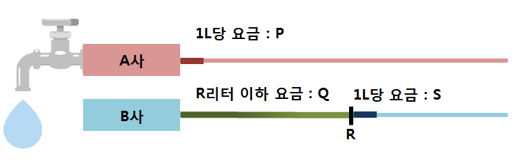

# S2-L1 · 수도 요금 경쟁

## 문제 설명

한 달에 W리터의 물을 사용합니다. 두 회사의 요금 중 더 저렴한 금액을 구하세요.  
  
A사는 사용한 물 1리터마다 P원을 받습니다.  
B사는 사용량이 R리터 이하이면 기본요금 Q원만 받습니다. R리터를 넘으면 초과한 양에 대해서만 1리터당 S원을 추가로 받습니다.  
  
기본요금에는 R리터까지의 사용료가 포함되어 있습니다.



A사와 B사의 사용량별 요금 구조

## 입력

전체 입력의 첫 줄에는 테스트케이스 수 T가 주어집니다. (1 ≤ T ≤ 3)  
이후 아래 설명에 따라 테스트케이스가 T개 이어집니다. 테스트케이스 사이에 빈 줄은 없습니다.  
  
한 줄에 P, Q, R, S, W가 순서대로 주어집니다.  
  
한 줄의 여러 값은 공백으로 구분됩니다. 문자열·지도 행의 공백 여부는 위 설명을 따르세요.

## 제약조건

- 1 ≤ P, Q, R, S, W ≤ 10000

## 출력

각 테스트케이스마다 한 줄에 #과 테스트케이스 번호 tc를 붙여 출력하고, 공백 한 칸 뒤에 정답을 출력합니다.  
tc는 1부터 시작합니다. 예: #1 10  
  
두 회사 중 더 저렴한 요금을 출력합니다.

```text
#tc answer
```

## 예제 입력

```text
2
9 100 20 3 10
8 300 100 10 250
```

## 예제 출력

```text
#1 90
#2 1800
```

## 공백과 줄바꿈 안내

코드 블록 안의 띄어쓰기는 실제 공백이며, 각 행은 실제 줄바꿈입니다. 긴 예제는 두 테스트케이스에서 일부 줄만 표시합니다. …는 생략 표시이며 실제 데이터가 아닙니다. 전체 보기 기능은 제공하지 않습니다.
