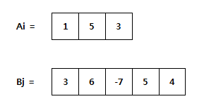
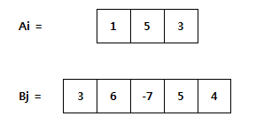
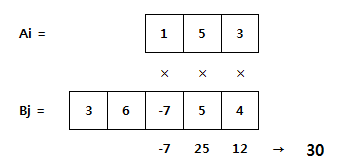

# S2-L2 · 두 개의 숫자열

## 문제 설명

두 정수 수열 A와 B를 나란히 놓습니다. 짧은 수열을 긴 수열 위에서 좌우로 이동시킬 수 있지만, 짧은 수열의 모든 원소가 긴 수열의 범위 안에 있어야 합니다.  
  
각 위치에서 마주보는 수끼리 곱한 뒤 모두 더합니다. 가능한 위치 중 이 합의 최댓값을 구하세요. 수열의 순서를 뒤집거나 바꾸지는 않습니다. 두 길이가 같으면 위치는 한 가지입니다.



두 숫자열의 배치



짧은 숫자열을 오른쪽으로 이동한 배치



마주 보는 값끼리 곱하는 방법

## 입력

전체 입력의 첫 줄에는 테스트케이스 수 T가 주어집니다. (1 ≤ T ≤ 3)  
이후 아래 설명에 따라 테스트케이스가 T개 이어집니다. 테스트케이스 사이에 빈 줄은 없습니다.  
  
첫 줄에 N과 M, 다음 줄에 A의 N개 수, 그다음 줄에 B의 M개 수가 주어집니다.  
  
한 줄의 여러 값은 공백으로 구분됩니다. 문자열·지도 행의 공백 여부는 위 설명을 따르세요.

## 제약조건

- 3 ≤ N, M ≤ 20
- 원소는 정수입니다. 음수와 중복도 허용합니다.

## 출력

각 테스트케이스마다 한 줄에 #과 테스트케이스 번호 tc를 붙여 출력하고, 공백 한 칸 뒤에 정답을 출력합니다.  
tc는 1부터 시작합니다. 예: #1 10  
  
마주보는 원소의 곱을 더한 값의 최댓값을 출력합니다.

```text
#tc answer
```

## 예제 입력

```text
2
3 5
1 2 3
1 2 3 4 5
3 3
1 1 1
-3 -2 -1
```

## 예제 출력

```text
#1 26
#2 -6
```

## 공백과 줄바꿈 안내

코드 블록 안의 띄어쓰기는 실제 공백이며, 각 행은 실제 줄바꿈입니다. 긴 예제는 두 테스트케이스에서 일부 줄만 표시합니다. …는 생략 표시이며 실제 데이터가 아닙니다. 전체 보기 기능은 제공하지 않습니다.
