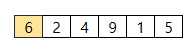
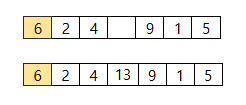
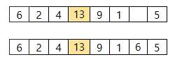
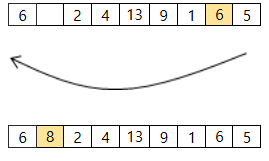

# S2-L5 · 암호

## 문제 설명

수열의 첫 숫자를 고정된 시작 숫자로 삼고, 그 위치에서 작업을 시작합니다. 지정 위치에서 앞으로 M칸 진행한 삽입 위치에 새 칸을 넣습니다. 마지막을 넘으면 시작 숫자부터 이어서 셉니다.  
  
새 값은 삽입 위치 바로 앞 숫자와 뒤로 밀려날 숫자의 합입니다. 수열 맨 끝에 삽입한다면 마지막 숫자와 시작 숫자를 더합니다. 삽입한 칸이 다음 작업의 지정 위치가 됩니다. 시작 숫자의 위치는 바꾸지 않습니다.  
  
이를 K번 수행한 뒤 수열 맨 끝부터 역순으로 최대 10개의 수를 출력하세요. 예를 들어 위치를 0부터 셀 때, 현재 위치 p에서 p+M이 길이와 같으면 맨 끝에 삽입합니다. 길이를 넘으면 순환하여 삽입하되, 정확히 한 바퀴 단위의 끝은 맨 끝 위치로 취급합니다.



초기 수열과 시작 위치



첫 번째 삽입 위치



두 번째 삽입 위치



끝을 지나 처음으로 돌아오는 세 번째 삽입

## 입력

전체 입력의 첫 줄에는 테스트케이스 수 T가 주어집니다. (1 ≤ T ≤ 3)  
이후 아래 설명에 따라 테스트케이스가 T개 이어집니다. 테스트케이스 사이에 빈 줄은 없습니다.  
  
첫 줄에 초기 길이 N, 이동 칸 수 M, 반복 횟수 K가 주어집니다.  
다음 줄에 초기 수열 N개가 주어집니다.  
  
한 줄의 여러 값은 공백으로 구분됩니다. 문자열·지도 행의 공백 여부는 위 설명을 따르세요.

## 제약조건

- 3 ≤ N, M, K ≤ 1000
- 1 ≤ 초기 값 ≤ 1000
- 삽입 결과는 1000을 넘을 수 있습니다.

## 출력

각 테스트케이스마다 한 줄에 #과 테스트케이스 번호 tc를 붙여 출력하고, 공백 한 칸 뒤에 정답을 출력합니다.  
tc는 1부터 시작합니다. 예: #1 10  
  
완성된 수열 뒤에서부터 최대 10개를 출력합니다.

```text
#tc answer
```

## 예제 입력

```text
2
6 3 3
6 2 4 9 1 5
3 3 3
1 2 3
```

## 예제 출력

```text
#1 5 6 1 9 13 4 2 8 6
#2 5 4 3 5 2 1
```

## 공백과 줄바꿈 안내

코드 블록 안의 띄어쓰기는 실제 공백이며, 각 행은 실제 줄바꿈입니다. 긴 예제는 두 테스트케이스에서 일부 줄만 표시합니다. …는 생략 표시이며 실제 데이터가 아닙니다. 전체 보기 기능은 제공하지 않습니다.
